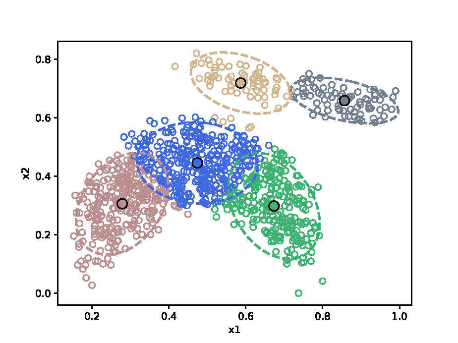

# Supplementary material

Supplementary material with analyses conducted for the article titled ***Subconcept perturbation-based classifier for within-class multimodal data***.

## Graphic images for sPerC applied to banana dataset 

Figure 1 shows the banana dataset, and Figures 2, 3, and 4 show the application of the sPerC algorithm on this dataset. The first step is to separate the classes in Figure 1, as shown in Figures 2a and 2b. After, Figures 3a and 3b show the result of the clustering k-Means algorithm per class. In the first class ($\Gamma_{1}$), the number of clusters was three, while in the second class ($\Gamma_{2}$) was five. As the final step, Figures 4a and 4b show the sPerC trained classifiers per cluster per class.

### 1. The *banana* dataset containing two classes.

### 2. The *banana* dataset separated into two classes: (a) $\Gamma_{1}$ and (b) $\Gamma_{2}$.

#### (a) $\Gamma_{1}$ subset.

#### (b) $\Gamma_{2}$ subset.

 

### 3. *Clusters* generated by *k-Means* for (a) $\Gamma_{1}$ and  (b) $\Gamma_{2}$.

#### (a) *k-Means* results for $\Gamma_{1}$  (${k_1 = 3}$)

 
#### (b) *k-Means* results for $\Gamma_{2}$ ($k_2 = 5$)

### 4. *sPerC* trained classifiers per class: (a) $\Gamma_{1}$ and (b) $\Gamma_{2}$.

#### (a) *sPerC* applied to $\Gamma_{1}$

#### (b) *sPerC* applied to $\Gamma_{1}$

## Tables

### AUC results for the 40 evaluated datasets. The best results per dataset are in bold. Friedman test: $7.403 \times 10^{-14}$. Ranking algorithms according to Bonferroni-Dunn *post-hoc* test: MLP $= 1.838$, sPerC $= 2.275$, Random Forest $= 2.925$, SVM $= 3.675$, PerC $= 4.288$ 

| Dataset | Random Forest | MLP | SVM | PerC | sPerC |
| :--- | :---: | :---: | :---: | :---: | :---: |
| balance | 0.770 | **0.981** | 0.800 | 0.798 | 0.727 |
| banana | 0.852 | **0.893** | 0.619 | 0.597 | 0.889 |
| banknote | 0.972 | **0.999** | 0.986 | 0.990 | 0.998 |
| bupa | **0.686** | 0.684 | 0.533 | 0.580 | 0.601 |
| cleveland-0vs4 | 0.632 | **0.819** | 0.667 | 0.547 | 0.767 |
| cleveland | 0.570 | 0.582 | 0.570 | 0.541 | **0.585** |
| ecoli-0-1-4-7vs2-3-5-6 | 0.810 | **0.852** | 0.824 | 0.665 | 0.804 |
| ecoli-0-1vs2-3-5 | 0.828 | 0.867 | 0.820 | 0.719 | **0.887** |
| ecoli-0-1vs5 | 0.874 | **0.879** | 0.875 | 0.685 | **0.879** |
| ecoli-0-2-3-4vs5 | 0.877 | 0.865 | 0.884 | 0.689 | **0.896** |
| ecoli-0-2-6-7vs3-5 | 0.808 | 0.609 | 0.812 | 0.631 | **0.839** |
| ecoli1 | **0.865** | 0.863 | 0.847 | 0.810 | 0.843 |
| ecoli2 | 0.854 | **0.887** | 0.854 | 0.724 | 0.855 |
| ecoli3 | 0.724 | **0.813** | 0.689 | 0.539 | 0.744 |
| glass-0-1-5vs2 | 0.500 | **0.645** | 0.500 | 0.500 | 0.546 |
| hayes-roth | **0.870** | 0.836 | 0.778 | 0.666 | 0.632 |
| indian-liver-patient | 0.532 | **0.599** | 0.500 | 0.500 | 0.533 |
| led7digit-0-2-4-5-6-7-8-9vs1 | 0.866 | **0.895** | 0.882 | 0.558 | 0.857 |
| new-thyroid1 | 0.967 | **0.973** | 0.838 | 0.903 | 0.964 |
| newthyroid2 | **0.964** | **0.964** | 0.836 | 0.902 | 0.961 |
| page-blocks0 | 0.858 | 0.913 | 0.754 | 0.906 | **0.929** |
| poker-8-9vs5 | 0.500 | 0.505 | 0.500 | 0.500 | **0.518** |
| shuttle-6vs2-3 | 0.990 | 0.955 | 0.900 | 0.950 | **0.991** |
| shuttle-c0-vs-c4 | **1.000** | 0.996 | 0.996 | 0.982 | 0.990 |
| transfusion | 0.619 | **0.646** | 0.510 | 0.571 | 0.604 |
| vertebral2c | 0.809 | **0.835** | 0.756 | 0.694 | 0.771 |
| vowel | 0.864 | **0.989** | 0.939 | 0.951 | 0.971 |
| winequality-red-3vs5 | 0.500 | 0.544 | 0.500 | 0.500 | **0.640** |
| winequality-red-4 | 0.500 | 0.503 | 0.500 | 0.500 | **0.520** |
| winequality-red-8vs6-7 | 0.500 | 0.498 | 0.500 | 0.500 | **0.549** |
| winequality-red-8vs6 | 0.500 | 0.520 | 0.500 | 0.500 | **0.547** |
| winequality-white-3-9vs5 | 0.516 | **0.570** | 0.500 | 0.500 | 0.556 |
| winequality-white-3vs7 | 0.557 | 0.607 | 0.500 | 0.522 | **0.620** |
| wisconsin | **0.973** | 0.961 | 0.972 | 0.945 | 0.954 |
| yeast-0-5-6-7-9vs4 | 0.553 | 0.708 | 0.509 | 0.534 | **0.743** |
| yeast-1-2-8-9vs7 | **0.540** | 0.531 | 0.500 | 0.500 | 0.539 |
| yeast-1-4-5-8vs7 | 0.500 | **0.503** | 0.500 | 0.500 | 0.500 |
| yeast-2vs4 | 0.839 | **0.854** | 0.782 | 0.693 | 0.850 |
| yeast-2vs8 | 0.724 | 0.756 | **0.774** | 0.718 | 0.551 |
| yeast4 | 0.502 | 0.596 | 0.500 | 0.500 | **0.684** |
| |
| Wilcoxon-p | $0.039$ | $0.196$ | $4.142 \times 10^{-4}$ | $5.031 \times 10^{-6}$ | n/a |
| |
| *Win/Tie/Loss* | 25/1/14 | 15/1/24 | 31/1/8 | 36/1/3 | n/a |
| |

### AUC results over 22 within-class multimodal datasets. The best results per dataset are in bold. Friedman test: $2.829 \times 10^{-8}$. Ranking algorithms according to Bonferroni-Dunn *post-hoc* test: sPerC $= 1.955$, MLP $= 2.045$, Random Forest $= 2.932$, SVM $= 3.750$, PerC $= 4.318$.

| Dataset | Random Forest  | MLP   | SVM   | PerC  | sPerC |
| :---    | :---:          | :---: | :---: | :---: | :---: |
| ecoli-0-1-4-7vs2-3-5-6 | 0.810 | **0.852** | 0.824 | 0.665 | 0.804 |
| ecoli-0-1vs2-3-5 | 0.828 | 0.867 | 0.820 | 0.719 | **0.887** |
| ecoli-0-1vs5 | 0.874 | **0.879** | 0.875 | 0.685 | **0.879** |
| ecoli-0-2-3-4vs5 | 0.877 | 0.865 | 0.884 | 0.689 | **0.896** |
| ecoli-0-2-6-7vs3-5 | 0.808 | 0.609 | 0.812 | 0.631 | **0.839** |
| ecoli1 | **0.865** | 0.863 | 0.847 | 0.810 | 0.843 |
| ecoli2 | 0.854 | **0.887** | 0.854 | 0.724 | 0.855 |
| ecoli3 | 0.724 | **0.813** | 0.689 | 0.539 | 0.744 |
| glass-0-1-5vs2 | 0.500 | **0.645** | 0.500 | 0.500 | 0.546 |
| led7digit-0-2-4-5-6-7-8-9vs1 | 0.866 | **0.895** | 0.882 | 0.558 | 0.857 |
| new-thyroid1 | 0.967 | **0.973** | 0.838 | 0.903 | 0.964 |
| newthyroid2 | **0.964** | **0.964** | 0.836 | 0.902 | 0.961 |
| page-blocks0 | 0.858 | 0.913 | 0.754 | 0.906 | **0.929** |
| poker-8-9vs5 | 0.500 | 0.505 | 0.500 | 0.500 | **0.518** |
| shuttle-6vs2-3 | 0.990 | 0.955 | 0.900 | 0.950 | **0.991** |
| winequality-red-4 | 0.500 | 0.503 | 0.500 | 0.500 | **0.520** |
| winequality-red-8vs6-7 | 0.500 | 0.498 | 0.500 | 0.500 | **0.549** |
| winequality-white-3-9vs5 | 0.516 | **0.570** | 0.500 | 0.500 | 0.556 |
| yeast-0-5-6-7-9vs4 | 0.553 | 0.708 | 0.509 | 0.534 | **0.743** |
| yeast-1-2-8-9vs7 | **0.540** | 0.531 | 0.500 | 0.500 | 0.539 |
| yeast-1-4-5-8vs7 | 0.500 | **0.503** | 0.500 | 0.500 | 0.500 |
| yeast4 | 0.502 | 0.596 | 0.500 | 0.500 | **0.684** |
| | 
| Wilcoxon-p | $0.007$ | $0.676$ | $5.789 \times 10^{-4}$ | $5.956 \times 10^{-5}$ | n/a |
| | 
| *Win/Tie/Loss* | 15/1/6 | 11/1/10 | 18/1/3 | 21/1/0 | n/a |
| | 
